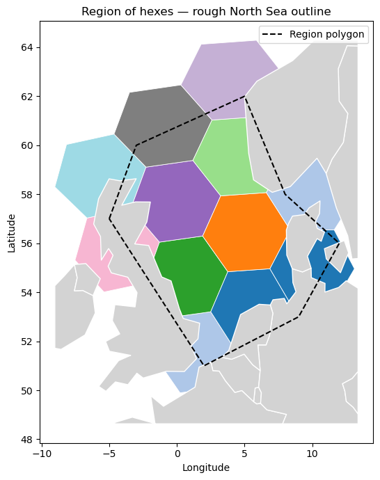
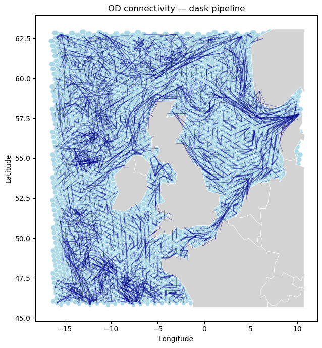

# hextraj

[](LICENSE)

Hex labelling of trajectory data.

| Hex region | OD connectivity |
|:---:|:---:|
|  |  |
| [hex_aggregation.ipynb](notebooks/hex_aggregation.ipynb) | [hex_conn_dask.ipynb](notebooks/hex_conn_dask.ipynb) |

Maps lon/lat positions to a projected hexagonal grid and provides tools for aggregation and connectivity analysis.

## Getting started

Explore the notebooks:

- [`hex_conn.ipynb`](notebooks/hex_conn.ipynb) — Label NW Shelf trajectories, compute OD connectivity, visualise choropleth + edge overlay.
- [`hex_aggregation.ipynb`](notebooks/hex_aggregation.ipynb) — Grid construction, choropleth aggregation, and weighted edges.
- [`hex_grid_construction.ipynb`](notebooks/hex_grid_construction.ipynb) — Rectangle and region hex grids.

## Installation

```shell
python -m pip install git+https://github.com/willirath/hextraj.git@main
```

## Quick example

```python
from hextraj import HexProj

hp = HexProj(lon_origin=-3.0, lat_origin=54.0, hex_size_meters=50_000)

# Label positions → int64 hex IDs
hex_ids = hp.label(lon, lat)

# Build a GeoDataFrame with Polygon geometries
gdf = hp.to_geodataframe(hp.region_of_hexes(region_polygon))
gdf["count"] = counts.reindex(gdf.index).fillna(0)
gdf.plot(column="count", cmap="YlOrRd")
```
